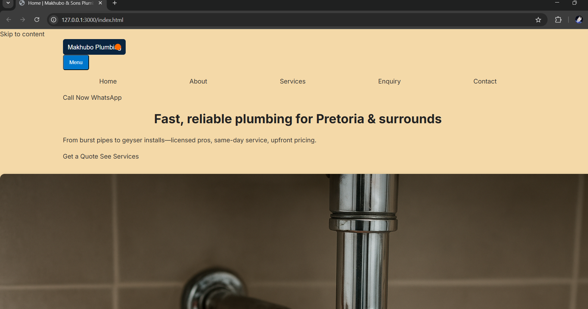
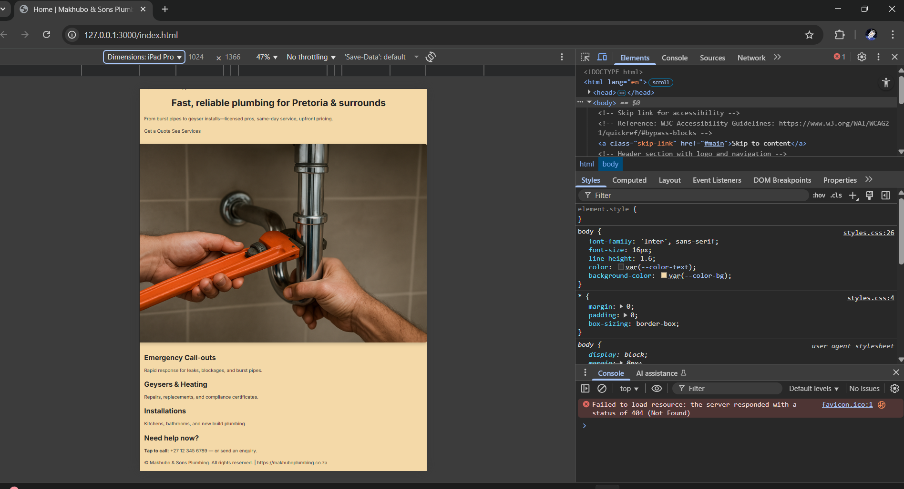
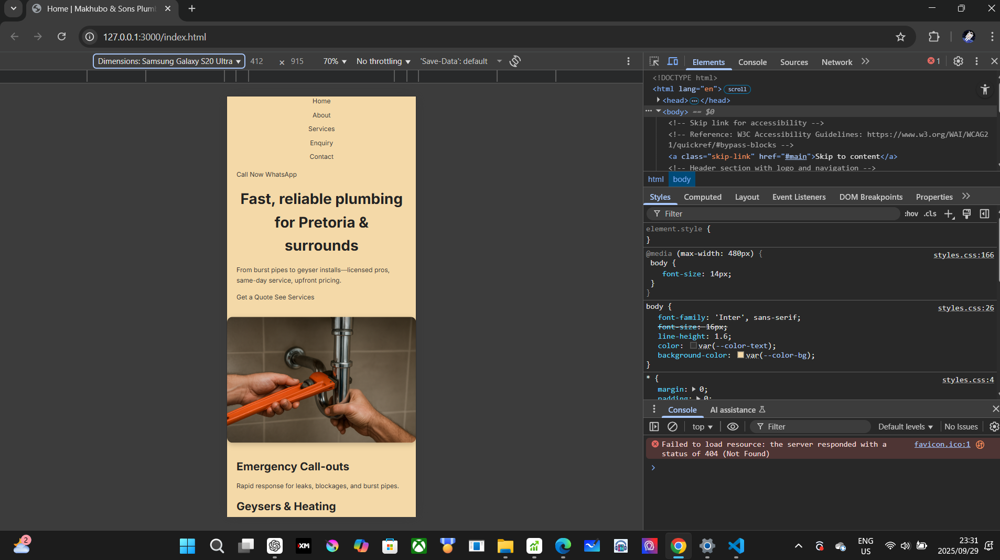

# Makhubo & Sons Plumbing Website

This repository contains the source code for the **Makhubo & Sons Plumbing** website, built as part of the Web Development project.  
The website showcases the company's services, contact details, and enquiry form in a clean, professional, and responsive layout.

---

## 📑 Project Overview

- **Company Name:** Makhubo & Sons Plumbing  
- **Location:** Pretoria, South Africa  
- **Objective:** Provide customers with a simple, mobile-friendly website that communicates services clearly, allows enquiries, and improves online presence.

---

## 🛠️ Technologies Used

- **HTML5** – Semantic and accessible structure for all pages.  
- **CSS3** – External stylesheet with reset, base styles, typography, layout, and responsive design.  
- **Flexbox/Grid** – For layout and alignment across sections.  
- **JavaScript (Vanilla)** – For menu toggle and small interactions.  
- **Git & GitHub** – Version control and repository hosting.

---

## 📂 Project Structure

---

## 🖌️ Features

- **Responsive Layout:** Works across desktop, tablet, and mobile.  
- **Accessible Navigation:** Skip links and proper ARIA labels.  
- **Typography & Branding:** Consistent fonts, colours, and spacing.  
- **Interactive Elements:** Hover effects, call-to-action buttons, and form styling.  
- **SEO Ready:** Meta tags and descriptive page titles.

---

## 📸 Screenshots (Responsive Design Evidence)

| Device | Screenshot |
|-------|-------------|
| Desktop |  |
| Tablet  |  |
| Mobile  |  |

> **Note:** These screenshots were taken using Chrome Developer Tools and resized windows for accurate testing.

---

## 📜 Changelog

### Part 1 (Structure & Content)
- **Commit 1:** Added base HTML structure for `index.html`.
- **Commit 2:** Created additional pages (`about.html`, `services.html`, `enquiry.html`, `contact.html`).
- **Commit 3:** Linked all pages with navigation menu.
- **Commit 4:** Added company description and headings for accessibility.
- **Commit 5:** Created initial repository README with project overview.
- **Commit 6:** Finalised Part 1 structure and pushed to GitHub.

### Part 2 (Styling & Responsiveness)
- **Commit 7:** Created external CSS file `styles.css` and linked to all HTML pages.
- **Commit 8:** Applied CSS reset and base typography (font-family, colour scheme, line-height).
- **Commit 9:** Used Flexbox for navigation, footer, and section layouts.
- **Commit 10:** Added hover effects, button styles, and improved visual hierarchy.
- **Commit 11:** Implemented media queries for tablet and mobile viewports.
- **Commit 12:** Added screenshots of responsive testing to README.
- **Commit 13:** Final proofreading, changelog update, and repository push.

---

## 📖 References

- **MDN Web Docs – HTML & CSS:** 
## References

- **image1**
- OpenAI. (2025). *Plumber working on pipes – AI generated image*. Generated using ChatGPT with DALL·E. Retrieved from local project assets.

  [https://developer.mozilla.org/](https://developer.mozilla.org/)

- **W3C CSS Specifications:**  
  [https://www.w3.org/TR/CSS/](https://www.w3.org/TR/CSS/)

- **Flexbox Guide:**  
  [https://css-tricks.com/snippets/css/a-guide-to-flexbox/](https://css-tricks.com/snippets/css/a-guide-to-flexbox/)

- **Responsive Design Basics:**  
  [https://developers.google.com/web/fundamentals/design-and-ux/responsive](https://developers.google.com/web/fundamentals/design-and-ux/responsive)

- **Colour Palette Inspiration:**  
  [https://coolors.co/](https://coolors.co/)

---

## 📬 Contact

For any enquiries regarding the website, contact:  
**Makhubo & Sons Plumbing**  
📍 Pretoria, South Africa  
📧 Email: info@makhubosonsplumbing.co.za  
📞 Phone: +27 000 000 0000
## Changelog from part 1
- Fixed missing alt attributes for images (Part 1 feedback).
- Corrected incorrect heading levels for accessibility.
- Added meta description for SEO (Part 1 feedback).
### Screenshots

**Desktop View**  

**Tablet View**  

**Mobile View**  

---

